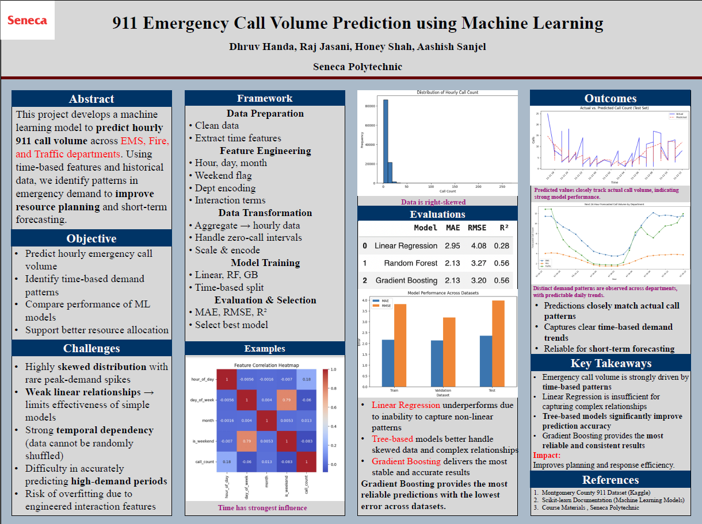

# 911 Emergency Call Volume Prediction using Machine Learning

## Project Overview

This capstone project focuses on predicting hourly 911 emergency call volume across **EMS, Fire, and Traffic departments** using historical emergency call data from Montgomery County, Pennsylvania.

The goal of this project is to analyze emergency call demand patterns and build a machine learning pipeline that can support short-term call volume forecasting. By identifying time-based trends and comparing different machine learning models, this project demonstrates how historical 911 data can support better emergency resource planning and operational preparedness.

---

## Business Problem

Emergency response agencies need to understand when call volumes are likely to increase so they can plan staffing, resources, and response readiness more effectively.

911 call demand is not random. It can vary based on:

- Hour of the day
- Day of the week
- Month
- Weekend vs weekday patterns
- Department type such as EMS, Fire, or Traffic

Without data-driven forecasting, emergency service planners may rely mainly on historical reporting instead of predictive insights. This project addresses that problem by building a machine learning approach to forecast short-term emergency call volume.

---

## Project Objectives

The main objectives of this project are:

- Predict hourly 911 emergency call volume
- Identify time-based demand patterns
- Analyze call volume differences across EMS, Fire, and Traffic departments
- Compare the performance of multiple machine learning models
- Evaluate models using regression metrics such as MAE, RMSE, and R²
- Support better resource allocation and emergency preparedness planning

---

## Team Members

- Dhruv Handa
- Raj Jasani
- Honey Shah
- Aashish Sanjel

---

## My Role

My role in this capstone project focused on **Exploratory Data Analysis (EDA) and Visualization**.

Responsibilities included:

- Analyzing temporal patterns in emergency call volume
- Exploring hourly, daily, and weekly demand trends
- Interpreting department-wise call patterns
- Creating visualizations to support project findings
- Helping communicate insights for the final report and poster

---

## Dataset Source

Dataset: **Montgomery County 911 Calls Dataset**  
Source: **Kaggle**

The dataset contains historical 911 emergency call records from Montgomery County, Pennsylvania.

Key fields used in this project include:

- `timeStamp` – date and time of the emergency call
- `title` – emergency call category used to identify department type
- `lat` and `lng` – geographic coordinates
- `zip` – ZIP code
- `twp` – township
- `addr` – address
- `desc` – call description

The raw dataset contains event-level emergency call records, which were transformed into hourly department-wise call volume data for forecasting.

---

## Tools and Technologies Used

- Python
- Pandas
- NumPy
- Matplotlib
- Seaborn
- Scikit-learn
- Jupyter Notebook
- Machine Learning
- Exploratory Data Analysis
- Feature Engineering
- Model Evaluation

---

## Project Workflow

### 1. Data Collection

The project used the Montgomery County 911 emergency call dataset from Kaggle.

### 2. Data Cleaning

Data cleaning steps included:

- Loading the raw 911 call dataset
- Checking dataset shape, columns, and data types
- Identifying missing values
- Reviewing duplicate records
- Converting timestamp fields into datetime format
- Removing or handling non-informative fields
- Checking data quality issues such as invalid ranges and outliers

### 3. Feature Engineering

Feature engineering was a major part of the project.

Created features included:

- Hour of day
- Day of week
- Month
- Weekend flag
- Department category: EMS, Fire, Traffic
- Hourly call count
- Department encoding
- Interaction-based features

The target variable was derived by aggregating individual 911 call records into hourly call counts.

### 4. Data Transformation

The raw event-level dataset was transformed into an hourly time-based dataset.

Transformation steps included:

- Aggregating call records by hour
- Aggregating call volume by department
- Handling zero-call intervals
- Encoding categorical department values
- Scaling or preparing features for machine learning models

### 5. Exploratory Data Analysis

EDA was performed to understand patterns in emergency call demand.

The analysis focused on:

- Hourly call volume trends
- Daily and weekly demand patterns
- Department-wise call distribution
- Time-based demand changes
- Skewed call volume distribution
- Peak demand periods
- Differences between EMS, Fire, and Traffic call patterns

### 6. Model Training

Multiple machine learning models were trained and compared:

- Linear Regression
- Random Forest Regressor
- Gradient Boosting Regressor

A time-based split was used to avoid data leakage and respect the temporal structure of the dataset.

### 7. Model Evaluation

The models were evaluated using:

- **MAE** – Mean Absolute Error
- **RMSE** – Root Mean Squared Error
- **R² Score** – Coefficient of Determination

The goal was to compare how well each model predicted hourly call volume.

---

## Models Used

### Linear Regression

Linear Regression was used as a baseline model. However, it underperformed because emergency call volume patterns were non-linear and influenced by complex time-based behavior.

### Random Forest

Random Forest performed better than Linear Regression by capturing non-linear relationships and handling skewed data more effectively.

### Gradient Boosting

Gradient Boosting provided the most reliable results overall. It handled complex patterns better and produced more stable predictions across the datasets.

---

## Key Findings

- Emergency call volume is strongly influenced by time-based patterns.
- Call volume distribution is highly right-skewed, with rare peak-demand spikes.
- Linear Regression was not sufficient for capturing complex emergency demand patterns.
- Tree-based models performed better because they captured non-linear relationships.
- Gradient Boosting provided the most reliable and consistent predictions.
- EMS, Fire, and Traffic departments showed different demand patterns.
- The model was more reliable for short-term forecasting than simple linear approaches.

---

## Evaluation Summary

The project compared model performance using MAE, RMSE, and R².

General findings:

- Linear Regression had weaker performance due to limited ability to capture non-linear patterns.
- Random Forest improved predictive accuracy.
- Gradient Boosting delivered the most stable and reliable performance.
- Predicted values closely followed actual call volume patterns in the final evaluation.

---

## Project Poster

The final project poster summarizes the full capstone workflow, including the abstract, objectives, challenges, modeling framework, evaluation results, outcomes, and key takeaways.



---

## Project Structure

```text
911-call-volume-prediction-ml/
│
├── notebooks/
│   ├── modeling_and_training.ipynb
│   └── final_model_evaluation.ipynb
│
├── reports/
│   ├── project_proposal.pdf
│   ├── eda_report.pdf
│   ├── capstone_poster.pdf
│   └── capstone_reflection.pdf
│
├── images/
│   └── poster_preview.png
│
└── README.md
```

##Project Files
Notebooks
modeling_and_training.ipynb
Contains machine learning modeling work, feature engineering, model training, and comparison.
final_model_evaluation.ipynb
Contains final model evaluation, prediction analysis, and performance comparison.
Reports
project_proposal.pdf
Initial project proposal describing the problem, dataset, objectives, technical challenges, and planned solution.
eda_report.pdf
Exploratory data analysis report covering data structure, missing values, descriptive statistics, outliers, text characteristics, and temporal patterns.
capstone_poster.pdf
Final project poster summarizing the project workflow, models, results, and key takeaways.
capstone_reflection.pdf
Reflection document from the capstone project.
Final Recommendations

##Based on the project results:

Emergency service agencies can use historical call data to identify predictable demand patterns.
Time-based features should be prioritized when forecasting emergency call volume.
Tree-based machine learning models are more suitable than simple linear models for this type of problem.
Gradient Boosting is recommended as the strongest model from this project.
Forecasting tools can support better staffing, planning, and emergency preparedness.
Future improvements could include weather data, holiday indicators, location-based demand patterns, and real-time deployment.
Future Improvements

##Possible future improvements include:

Add weather data to capture weather-related emergency demand
Include holidays and special event indicators
Build department-specific forecasting models
Add geographic clustering by township or ZIP code
Deploy the model as an interactive dashboard or web app
Test additional models such as XGBoost, Prophet, or LSTM
Improve prediction of rare high-demand spike periods
Skills Demonstrated

##This project demonstrates:

Data cleaning
Exploratory data analysis
Time-based feature engineering
Data aggregation
Machine learning modeling
Regression model evaluation
Forecasting workflow design
Data visualization
Public-sector analytics
Team collaboration
Technical communication
Contact
